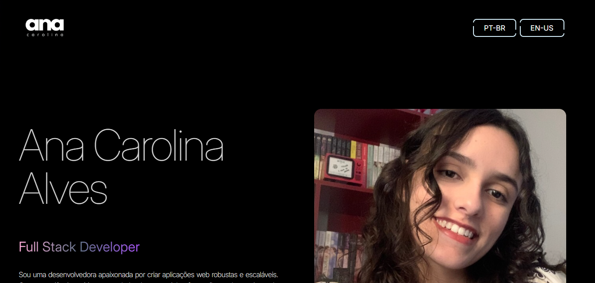

# Portfólio

## 🌐 Leia o README em Inglês

Se você preferir ler o README em Inglês, [clique aqui](README.md).

## 🛠️ Sobre o Projeto

> Um site de portfólio pessoal para apresentar projetos, formação academica, habilidades, publicações, organizações e informações de contato.

Acesse: [Portfólio](https://acaf02-portfolio.vercel.app/)

## 🧰 Tecnologias Utilizadas

Este projeto utiliza as seguintes tecnologias:

- **Frontend**: React.js, Tailwind CSS, JavaScript
- **Deploy**: Vercel

## 📜 Licença

Este projeto está sob a Licença MIT. Veja o arquivo [LICENÇA](LICENSE) para mais detalhes.
